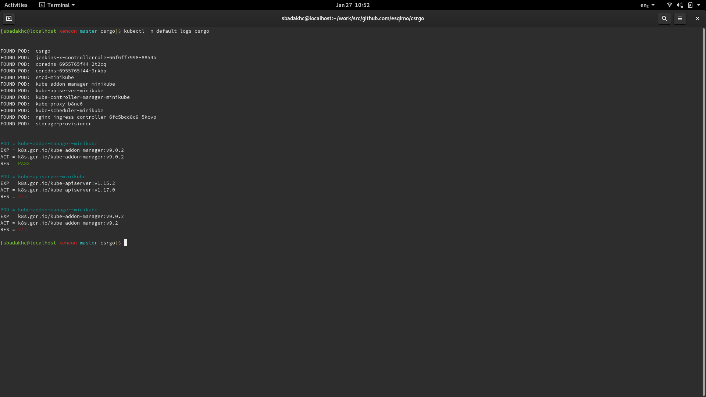

# Critical Systems Reconciliation GO

The puposes of CSRGO is to provide reconcilistion of a k8s clusters runtime 
configuration and associated resources. This is tested against an agreeed
specification and known state of the system in question. This repository 
contains unit tests for the components which assemble these critical systems 
and which together make up a complete deployment of the cloud infrastructure, 
application platform and mobile application. 



### Approach
Test coverage is the main priority of any CSRGO effort. Once the api has been
studied and the appropriate tool or tools have been selected the test cases
can be written. They should be coded in an atomised way so that they can be  
exported with minimal refactoring to another test runner and executed as 
part of a CI/CD process.

### Desgin goals
The test runner should be achieve the following design goals.
```
1. Execute a single unit test against a given system api.
2. Execute a suite of unit tests for a given system api.
4. Execute tests in parallel.
5. Exercise api's from both inside and outside of the cluster.
6. Produce machine-readable output for further processing.
```

### Prerequisites
Ensure you have access to the Google Cloud Platform and kubectl access to the
Google Kubernetes Engine.
```
0. Access to a kubernetes cluster
1. Request IAM and confirm access.
2. Ensure all the tooling is configured accordingly.
```

Make sure your environment is configured for the project and cluster you are testing.
```
]$ kubectx
dev
uat
prd
```

### Tooling
Ensure you have the following tools installed. It's recommeded to have auto 
completion configured for these tools where possible. Please refer to the 
tooling pages for instructions on how to enable it. 
```
0. bash
1. git
2. gcloud
3. kubectl
4. kubectx
5. kail
6. brew
7. go
```

### Deployment
Run the deploy.sh script
```
./deploy.sh
```

### Test Execution
The output of the tests can be seen by getting the logs for the csrgo container.
```
kubectl -n default logs csrgo
```
